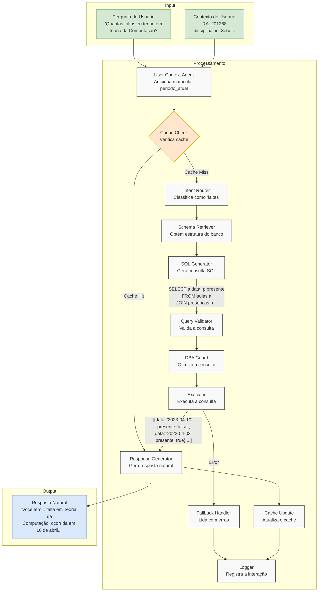

# Fluxo de Dados no Sistema Multi-Agentes Acadêmico

## Transformações de Dados em Cada Etapa

1. **Entrada**:
   - Pergunta do usuário: "Quantas faltas eu tenho em Teoria da Computação?"
   - Contexto do usuário: RA, disciplina_id, nome_disciplina

2. **User Context Agent**:
   - Adiciona: matricula (mapeada do RA), periodo_atual
   - Estado: `{user_query, user_id, user_context{RA, disciplina_id, matricula, periodo_atual}}`

3. **Cache Check**:
   - Verifica se há resposta em cache para esta consulta
   - Se hit: pula para Response Generator
   - Se miss: continua o fluxo

4. **Intent Router**:
   - Classifica a intenção como "faltas"
   - Adiciona: `{intent: "faltas", confidence: 0.95}`

5. **Schema Retriever**:
   - Obtém estrutura do banco de dados
   - Adiciona: `{schema_info: {tables: [...]}}`

6. **SQL Generator**:
   - Gera a consulta SQL
   - Adiciona: `{generated_sql: "SELECT a.data, p.presente FROM aulas a JOIN presencas p..."}`

7. **Query Validator**:
   - Valida a consulta SQL
   - Adiciona: `{validation_results: [...]}`

8. **DBA Guard**:
   - Otimiza a consulta (adiciona LIMIT, etc.)
   - Atualiza: `{generated_sql: "SELECT a.data, p.presente ... LIMIT 100"}`

9. **Executor**:
   - Executa a consulta no Supabase
   - Adiciona: `{query_results: [{data: "2023-04-10", presente: false}, ...]}`

10. **Response Generator**:
    - Converte resultados em linguagem natural
    - Adiciona: `{natural_response: "Você tem 1 falta em Teoria da Computação..."}`

11. **Cache Update**:
    - Armazena a resposta em cache
    - Não modifica o estado

12. **Logger**:
    - Registra a interação
    - Não modifica o estado

13. **Saída**:
    - Resposta natural para o usuário
