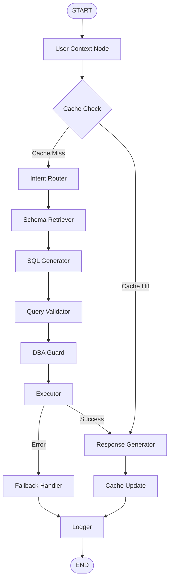

```mermaid
flowchart TD
    START([START]) --> UserContextNode[User Context Node]
    UserContextNode --> CacheCheck{Cache Check}
    
    CacheCheck -->|Cache Miss| IntentRouter[Intent Router]
    CacheCheck -->|Cache Hit| ResponseGenerator[Response Generator]
    
    IntentRouter --> SchemaRetriever[Schema Retriever]
    SchemaRetriever --> SQLGenerator[SQL Generator]
    SQLGenerator --> QueryValidator[Query Validator]
    QueryValidator --> DBAGuard[DBA Guard]
    DBAGuard --> Executor[Executor]
    
    Executor -->|Error| FallbackHandler[Fallback Handler]
    Executor -->|Success| ResponseGenerator
    
    FallbackHandler --> Logger[Logger]
    ResponseGenerator --> CacheUpdate[Cache Update]
    CacheUpdate --> Logger
    Logger --> END([END])
```
